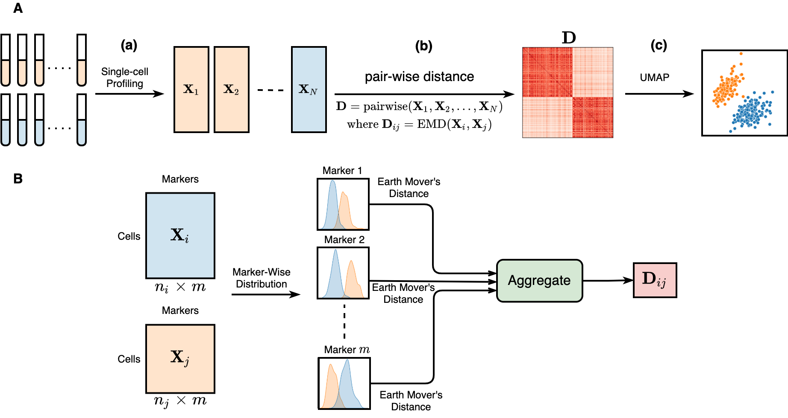

## CytoEMD
### Representation Learning of Cytometry Samples using Earth Mover's Distance

[](https://github.com/CompCy-lab/CytoEMD/actions/workflows/test.yml)

### Installation

#### Requirements

- Python >= 3.7 and other dependent python packages can be automatically inferred via `pip`.

```
pip install .
```

### Introduction

CytoEMD is a Python package for representation learning of samples in mass or flow cytometry data. CytoEMD uses earth mover's distance (EMD) to quantify the distances between cytometry samples and learns the representation of each sample using common methods like `UMAP` or `MDS`. The work flow of CytoEMD is as follows:




### Tutorial

We provide the tutorials of using CytoEMD to characterize the cytometry samples:

- [Quick-start tutorials of CytoEMD](./notebooks/CytoEMD_tutorial.ipynb)

The notebooks that can reproduce the figures in the paper are also provided under the directory [notebooks](./notebooks).


### Citation
TBD

### Contact
If you have any questions, feel free to submit an issue on the dashborad.